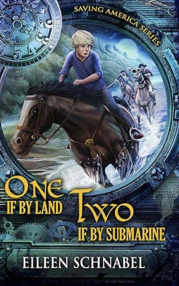

# Saving America Series – Volume 1

## Cliff Notes Companion

This repository contains structured chapter summaries and narrative analysis for **Volume 1 of the Saving America Series**.

The goal is to create a clear **Cliff Notes–style companion** that tracks:

* chapter events
* character motivations and perspectives
* clues revealed through character interpretation
* unresolved narrative questions
* the progression of the story’s central mysteries
* the historical ideas and themes embedded in the story

The project is designed so that summaries remain **consistent across all chapters** and so that the evolving mystery of the story can be tracked systematically.

---

# Repository Structure

vol1/
├── README.md  
├── chapters/  
├── matrices/  
├── project_docs/  
└── templates/  

## chapters/

Contains one Markdown file per chapter.

Example:

chapters/ch01.md  
chapters/ch02.md  
chapters/ch03.md  

Each chapter file follows the same structure so that summaries remain consistent across the entire book.

---

## matrices/

Contains **breadcrumb matrices** that track how narrative clues develop across chapters.

Each matrix covers approximately **5–6 chapters** and lists major mystery threads as rows and chapters as columns.

Example files:

breadcrumb_01-06.md  
breadcrumb_07-12.md  

---

## templates/

Reusable templates for creating new chapter summaries and matrices.

These ensure consistent formatting throughout the project.

Example files:

chapter_template.md  
breadcrumb_template.md  

---

## project_docs/

Supporting documentation describing the methodology and structure of the project.

Example:

project_structure.md  

---

# Chapter Summary Structure

Each chapter summary contains **four sections**.

## Plot Summary

A concise chronological description of the chapter’s events.

Guidelines:

* focus on events that advance the story
* avoid unnecessary detail
* maintain clarity and brevity

---

## Character Perspectives

Tracks how the four main characters interpret the unfolding events.

Presented as a table.

| Name | Motivation | Understanding of Events |
| ---- | ---------- | ----------------------- |
| Kep  |            |                         |
| TJ   |            |                         |
| Max  |            |                         |
| Tela |            |                         |

This section emphasizes:

* how each character interprets the situation
* how their motivations influence their reactions
* what the characters begin to **learn about themselves**, their abilities, or their values

When appropriate, this section also highlights moments where the **reader may recognize clues or implications that the characters do not yet fully understand**. These insights are captured through the characters’ observations, dialogue, or reactions.

---

## Emerging Questions

Lists the important unresolved questions raised by the chapter.

These questions represent the narrative tension driving the story forward.

---

## Historical Themes and Details

Historical fiction often embeds meaningful historical ideas, references, and themes within the narrative.

This section captures:

* historical facts or events referenced in the chapter
* historical practices, technology, or cultural norms depicted in the story
* ideas about American history that the author appears to emphasize
* moments designed to deepen the reader’s appreciation of the historical setting

The goal is to document **how the novel uses narrative to illuminate historical ideas and themes**.

---

# Breadcrumb Matrix

The breadcrumb matrix tracks the evolution of the story’s mysteries across chapters.

Rows represent **major mystery threads**, while columns represent chapters.

Each cell contains a short description of the clue introduced in that chapter.

Example structure:

| Mystery Thread       | Ch1         | Ch2         | Ch3          | Ch4                  | Ch5 | Ch6 |
| -------------------- | ----------- | ----------- | ------------ | -------------------- | --- | --- |
| Burglaries           | Kep robbed  | Tela robbed | TJ item      | –                    |     |     |
| DNA samples          | –           | toothbrush  | kerchief     | –                    |     |     |
| Time travel research | rumor       | drawings    | Fox decoding | mission revealed     |     |     |
| Camp infrastructure  | reenactment | –           | cameras      | underground facility |     |     |

The matrix allows readers to visually track how the mystery unfolds throughout the book.

---

# Project Goals

The project aims to produce a structured companion that:

* clarifies the story’s plot progression
* tracks character motivations and interpretations
* documents the clues that build the mystery
* highlights unanswered questions
* captures the historical ideas embedded in the narrative
* reveals the architecture of the story’s mystery

The result should function both as a **study guide** and as a **structural analysis of the novel**.

---

# Workflow

1. Create chapter summaries in the chapters directory.
2. Maintain consistent formatting using the templates.
3. Update breadcrumb matrices as new clues appear.
4. Use Git revision control to track changes and improvements.

---

# Status

The project begins with **Chapter 1 summaries and initial mystery tracking** and will expand progressively as additional chapters are analyzed.